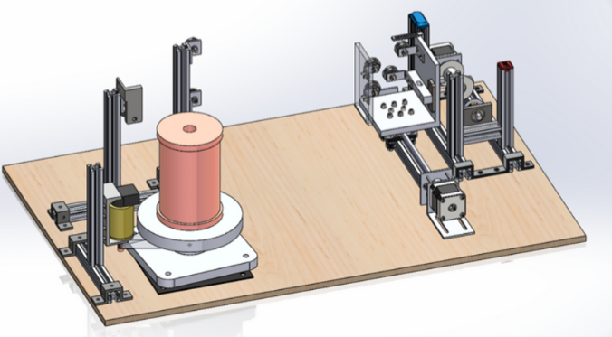
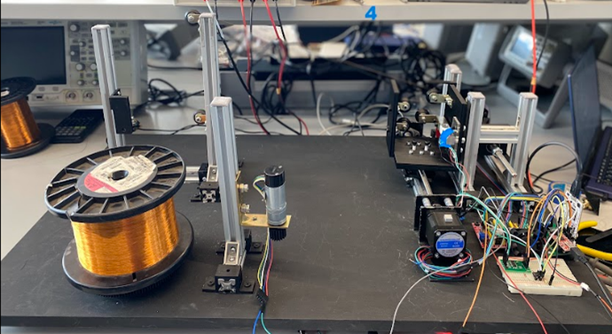
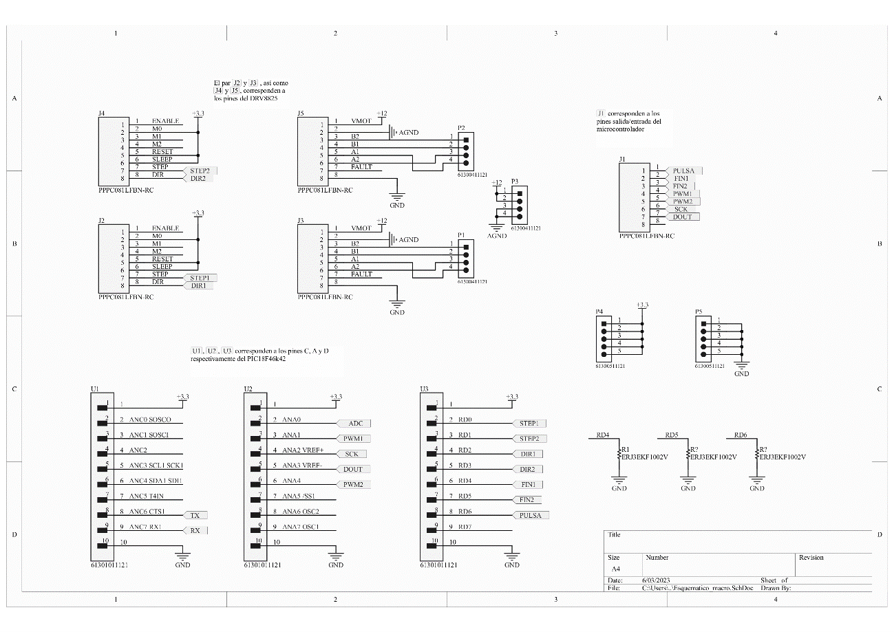
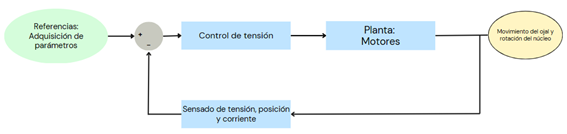
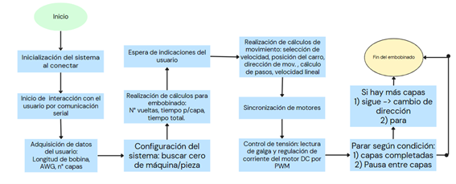
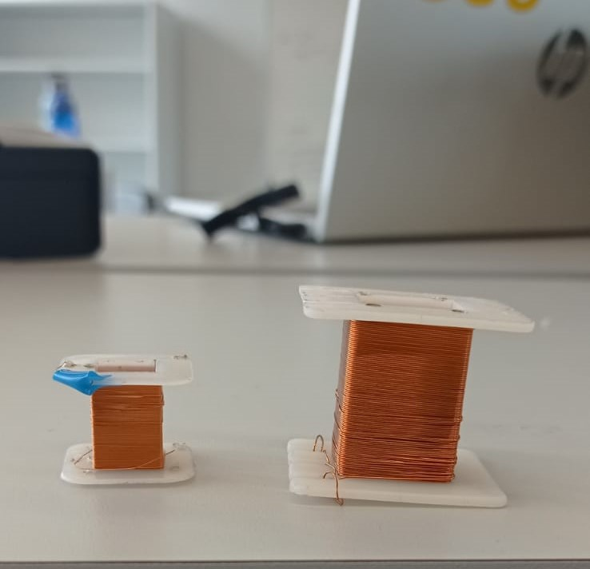

# Máquina de Embobinado Automático

## Descripción del Proyecto

**Kiubs Winding Machine (KWM)** es una máquina de embobinado automático diseñada para facilitar la construcción de transformadores y bobinas para proyectos de pequeña y mediana escala. Este sistema permite al usuario configurar parámetros clave, como calibre del alambre, número de vueltas, y tipo de bobina, proporcionando un proceso más eficiente, preciso y menos propenso a errores.

---

## Contexto y Motivación

La fabricación manual de bobinas es un proceso complejo y lento, especialmente para calibres pequeños. La falta de precisión y los materiales desperdiciados son desafíos comunes. Este proyecto busca resolver estos problemas mediante una solución automatizada accesible, ideal para estudiantes e investigadores.

---

## Características Principales

- **Compatibilidad con distintos tipos de bobinas:** Diseñada para bobinas circulares y cuadradas.
- **Control de tensión avanzado:** Mantiene una tensión constante para prevenir rupturas o sobrelapsos.
- **Configuración flexible:** El usuario puede especificar parámetros como número de vueltas, calibre del cable y velocidad de embobinado.
- **Interfaz de usuario:** Control sencillo mediante comandos seriales y una máquina de estados finitos.
- **Diseño modular:** Componentes impresos en 3D, perfiles de aluminio y sistemas de poleas ajustables.

---

## Cómo Usar la Máquina

1. **Configurar los parámetros:** 
   - Introducir longitud, calibre del cable y número de capas.
   - Especificar si se necesita aislamiento entre capas.
2. **Preparar la bobina:** Asegurarla en la máquina y pasar el cable a través de las guías.
3. **Iniciar el proceso:** Utilizar la interfaz serial para enviar el comando de inicio.
4. **Monitorear el proceso:** La máquina ajustará automáticamente la tensión y velocidad según los parámetros.
5. **Finalizar:** Retirar la bobina cuando el sistema indique la conclusión.

---

## Galería de Imágenes

### Diseño CAD del Sistema

### Ensamble Final

### Montaje electrónico realizado

### Diagramas del Proceso
Comportamiento del sistema en lazo cerrado:

Diagrama de flujo de los pasos que sigue el sistema:

### Resultados de embobinado

---

## Videos del Proyecto

- **Video en funcionamiento:**  

Sustituye `path/to/thumbnail.png` con las miniaturas y `link/to/video` con los enlaces a los videos.

---

## Estructura del Repositorio

- **`/code`:** Código fuente del firmware implementado en el microcontrolador.
- **`/designs`:** Modelos CAD de la máquina y diagramas de circuito.
- **`/docs`:** Documentación técnica, incluyendo reportes y manuales.
- **`/tests`:** Resultados de las pruebas realizadas y scripts de validación.

---

## Limitaciones

- No apta para alambres con calibres inferiores a AWG 9.
- Requiere cierta experiencia para el manejo inicial.
- Disminución de precisión a altas velocidades (más de 500 rpm).
- Dimensiones y peso considerables, dificultando el transporte.

---

## Créditos

Este proyecto fue desarrollado por:

- **María Alejandra Amaya Mejía** (amaya_maria@javeriana.edu.co)  
- **Roberto Andrés Cuervo Torres** (ra.cuervo@javeriana.edu.co)  
- **Karen Vanessa Wilches Beltrán** (karenv-wilchesb@javeriana.edu.co)

---

## Licencia

Este proyecto se encuentra bajo la licencia [MIT](LICENSE), lo que permite su uso, modificación y distribución para fines académicos y comerciales. 
